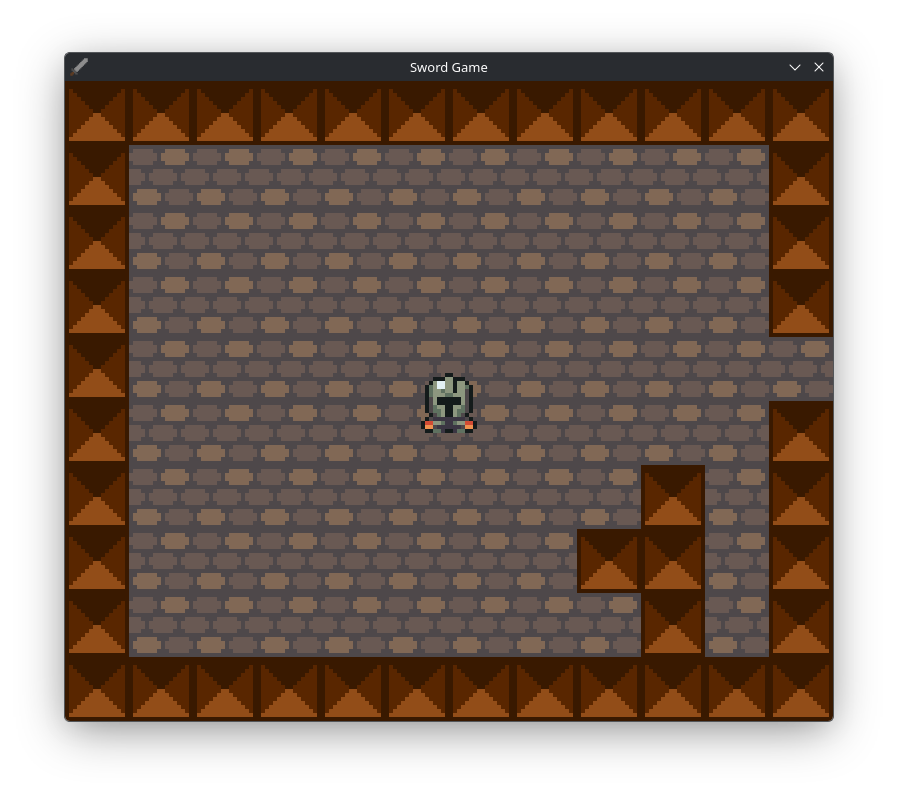
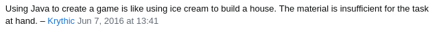

# progetto-mdc2026



## Prerequisiti
- Java 25 (LTS)
- Gradle

## Istruzioni

```bash
git clone "https://github.com/tom-acciarresi/progetto-mgc2026.git";
cd progetto-mgc2026 &&
gradle run
```

## Controlli

- W, A, S, D -- Movimento
- ⬅, ⬆, ➡, ⬇ -- Attacco direzionale
- ESC -- Esci dal gioco

## Crediti

- [Asset Pack Utilizzato](https://pixel-boy.itch.io/ninja-adventure-asset-pack)


---




